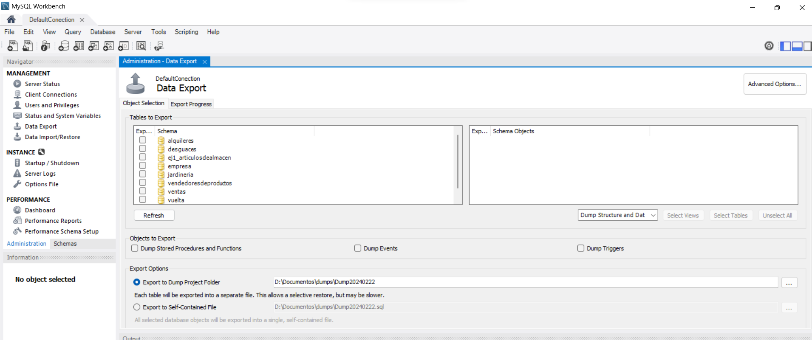
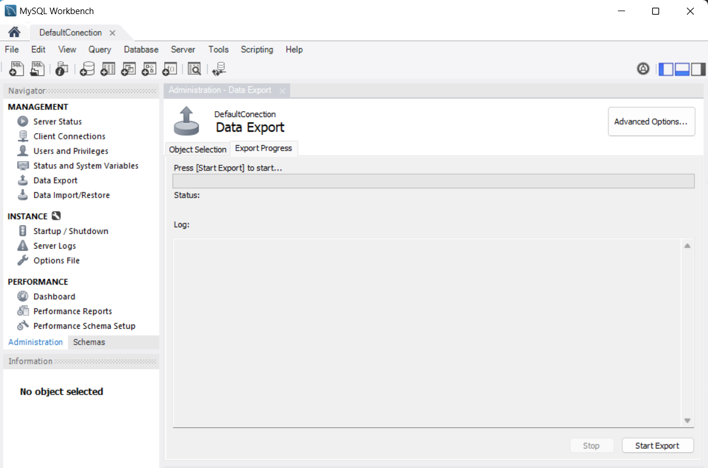

CE 6.1
a) Se han identificado herramientas gráficas y en línea de comandos para la administración de copias de seguridad.

CE 6.2
b) Se han realizado copias de seguridad.

CE 6.3
c) Se han restaurado copias de seguridad.

CE 6.4
d) Se han identificado las herramientas para importar y exportar datos.

CE 6.5
e) Se han exportado datos a diversos formatos.

CE 6.6
f) Se han importado datos con distintos formatos.

CE 6.7
g) Se ha interpretado correctamente la información suministrada por los mensajes de error y los ficheros de registro.

CE 6.8
h) Se ha transferido información entre sistemas gestores.

# UNIDAD 7. GESTIÓN DE LA SEGURIDAD DE LOS DATOS

## 1.- SEGURIDAD EN LAS BASES DE DATOS.

Se entiende por seguridad de los datos al conjunto de medidas que se toman para evitar el acceso indebido y robos en estos para ser tratados de manera inadecuada.

Se puede decir que la seguridad de los datos tiene tres vertientes:

- Confidencialidad: Garantiza que la información no sea difundida sin consentimiento. La garantía de esta circunstancia se da con un conjunto de reglas que limitan el acceso a la información.
- Integridad: permite que solo puedan acceder a los datos personas autorizadas. A quienes accedan a los datos se les aplicarán protocolos de autentificación, políticas internas y sistemas de control de acceso.
- Disponibilidad: se refiere a que la información de la base de datos está dispuesta para ser usada. Debe garantizarse su funcionamiento y confiabilidad de esta.

Para cumplir estas condiciones, hay que intentar:

- Enmascarar los datos, es decir, permitir a los usuarios ver la información que necesitan.
- Limitarse a los servicios, aplicaciones y funcionalidades realmente necesarias, y así disminuir el riesgo de acceso a cualquier información.
- Mantener actualizadas las bases de datos.
- Utilizar herramientas que permitan analizar los datos.
- Hacer frecuentemente copias de seguridad.

# 2.- RECUPERACIÓN DE DATOS

Se entiende por fallo del sistema gestor de bases de datos aquellas caídas que se producen en el sistema debido al mal funcionamiento del hardware o del software que afectan a las transacciones o grupo de sentencias DML que se están produciendo.

Se dice que un SGBD es eficiente si siempre es capaza de levantarse o recuperarse automáticamente cuando se ha producido un fallo.

Siempre que existe una transacción el sistema gestor tiene que ser capaz de asegurar que dicha transacción se ha realizado de manera exitosa y por tanto que ha guardado los datos en la base de manera correcta.
Los fallos se pueden producir por:
* Caída del sistema. Durante la ejecución de la transacción se produce un fallo de software hardware o de red punto
* Fallo de disco. Algunos bloques del disco pueden perder los datos por mal funcionamiento de la lectura y escritura en el disco punto esto puede producirse cuando se lee o escribe una transacción.
* Problemas físicos y catástrofes.se produce cuando falta suministro de energía incendio robo o sabotaje.
* Ataques externos y virus se produce si hay entrada de un virus que no permita que las transacciones se realicencorrectamente.es conveniente que tenga un antivirus seguro y actualizado.
* Producidos por errores de diseño de la base de datos coma si la base de datos no tiene un buen diseño, es posible que las transacciones no se realicen de forma adecuada en la misma.
* Un error de la transacción o del sistema en operaciones de la transacción puede hacer que esta falle coma por ejemplo coma si se produce un desbordamiento.
* Condiciones de excepción de la transacción. Durante la ejecución de transacciones puede presentarse condiciones que requiera la cancelación de esta punto
* Concurrencia en latransacción.se entiende por concurrencia cuando dos usuarios acceden a la misma transacción al unísono punto cuando ocurre esto se producen bloqueos como forma de autoprotección del sistema gestor punto los bloqueos son mecanismos que previenen conflictos entre las transacciones, que acceden a los mismos recursos coma bien sea un objeto de usuario o un objeto del sistema no visible por los usuarios.

# 3.- COPIAS DE SEGURIDAD

Hoy se define copia de seguridad al proceso de consiste en duplicar la información de un soporte, con el fin de poder recuperarlos en caso de fallo del primer lugar donde está alojada la información punto las copias de seguridad en las empresas son importantísimas coma pues salvaguardan el negocio.
Existen diferentes tipos de copias de seguridad coma pero los más usados son:
* completa punto todos los datos se copian en sus diferentes archivos y carpetas coma es decir se hacen duplicados de todos los datos guardados punto la restauración de una copia de seguridad completa es rápida punto sin embargo coma cada ejecución es lenta y ocupa más espacio con respecto a las otras tipologías.
Asteriscoincremental.se realiza una copia de seguridad completa coma y las siguientes copias que se vayan haciendo incluirán únicamente los cambios desde la última copia de seguridad punto el proceso de backup es mucho más rápido y requiere menos espacio que la copia completa.
Asteriscodiferencial.se realiza una copia de seguridad de todos los cambios realizados desde la última copia de seguridadcompleta.es mucho más rápida y requiere menos espacio de almacenamiento que una copia completa punto las restauraciones son más lentas que una copia de seguridad completa y más rápida que una incremental. Hola
* espejo. Guardan aquellos datos que se modifiquen en tiemporeal.es un reflejo fiel de la fuente que se está respaldando coma lo que implica que un archivo eliminado en el origen coma también se eliminará en la copia de seguridad. Debido a esto coma este tipo de copia de seguridad debe usarse con precaución.
Otros autores también establecen la siguiente clasificación:
* el frío, esta copia de seguridad se hace parando la base de datos, evitando que los usuarios puedan conectarse cuando se esté haciendo la copia coma lo que permite que se haga de manera estable.
* en caliente coma no se detiene la base de datos, pudiendo acceder a ella a los usuarios mientras se realiza la copia de seguridad.
Las copias de seguridad deben de realizarse de forma periódica, pudiéndose hacer de forma diaria si es completa o una copia semanal completa y una diferencial o incremental diaria.

# 4.- COPIA DE SEGURIDAD EN MYSQLWORKBENCH

Para realizar una copia de seguridad en MySql Workbench, tenemos la opción de realizarlo exportando una o varias bases de datos.

En esta pantalla se pueden elegir de que bases de datos se quiere hacer copia de seguridad, si solo se quiere guardar la estructura o los datos también, si se quiere guardar en una carpeta o en un fichero autocontenido. Una vez elegidas todas las opciones, además de la ubicación y el nombre, se pasa a la segunda pestaña para llevar a cabo la operación.

El proceso de recuperación se realiza a la inversa, con la opción de importar las bases de datos.

